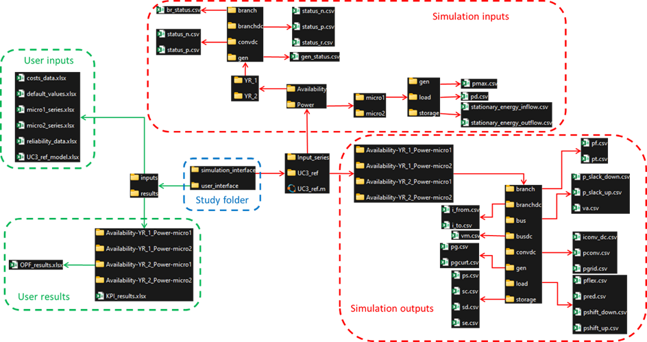

# HVDCWISE_TEA.jl

[](https://HVDC-WISE.github.io/HVDCWISE_TEA.jl/stable/)
[](https://HVDC-WISE.github.io/HVDCWISE_TEA.jl/dev/)
[](https://github.com/HVDC-WISE/HVDCWISE_TEA.jl/actions/workflows/CI.yml?query=branch%3Amain)
[](https://codecov.io/gh/HVDC-WISE/HVDCWISE_TEA.jl)

## Overview

HVDCWISE_TEA.jl is a Julia package to perform techno-economic analyses of HVDC expansion candidates for large scale, hybrid AC/DC power transmission networks.
A multi-period, hybrid AC/DC Optimal Power Flow problem is built in order to quantify the change in operational costs related to the HVDC expansion candidates.
The package builds upon the [PowerModels](https://github.com/lanl-ansi/PowerModels.jl), [PowerModelsMCDC](https://github.com/Electa-Git/PowerModelsMCDC.jl), [FlexPlan](https://github.com/Electa-Git/FlexPlan.jl) and [CbaOPF](https://github.com/Electa-Git/CbaOPF.jl) packages, using a similar structure.


## Development

HVDCWISE_TEA.jl is a research-grade software whose version 1.0 was developed by RSE (Matteo BAU) and SuperGrid Institute (Aubin MIELVAQUE, Nicolas BARLA).
If you have suggestions for improvement, please contact us via the Issues page on the repository.

## Acknowledgements

This code is being developed as part of the HVDC-WISE project under the European Union’s Horizon 2020 research and innovation programme (grant agreement no. 101075424).

## License

This code is provided under a [BSD 3-Clause License](/LICENSE.md).


## User guide

### Configure a study

Running a study consists in assessing a macro-scenario (grid model and associated cost assumptions) for several micro-scenario (time series of contingencies per component, available power per generator, and demand per load).
The macro-scenario and associated micro-scenarios must be defined in the user folder, in which the post-processed results will be saved at the end of the sequence. User inputs and results are Excel files containing data in their base units (MVA, kV, kA, …) while intermediary simulation inputs and outputs are text (.csv or .m) files with data in per unit.
The folder structure of the study “UC3_ref” is detailed in the figure below. This study performs the evaluation of a single macro-scenario. To compare different expansion planning solutions, several macro-scenarios must be analyzed.

Simulation inputs, simulation outputs, and user results are automatically generated by the software. To configure a study, the user must fill in the Excel files in the subfolder user_interface/inputs/ of the study folder.
The templates for these files are downloadable in the folder **[templates](templates)** in this repository:
- cost_data.xlsx contains cost assumptions for generators and loads
- {macro-scenario}_model.xlsx (with “macro-scenario” being the name of the study) contains the grid model description (installed power per generator, electrical parameters of cables, ...)
- default_values.xlsx contains miscellaneous parameters common to all components with the same type. They are used to build the .m file in Matpower format for the simulation inputs.
- reliability_data.xlsx contains some component reliability assumptions and the number of time series of contingencies (availability status of components) to generate (there will be 1 micro-scenario per contingency series and per power series provided by the user in the {micro-scenario}_series.xlsx files)
- {micro-scenario}_series.xlsx (with “micro-scenario” being the name of a micro-scenario for a power series, for example 1995, 2008, or 2009 for TYNDP data [2024](https://2024.entsos-tyndp-scenarios.eu/download/)) contains time series of demand per load, available power per generator, and energy inflow (storage natural charging) per storage

All these inputs (units, description, ...) are detailed in the Excel templates.

### Software installation

Several software must be installed before installing and running HVDCWISE_TEA:
- Julia
- Octave or Matlab
- VSCode

[Julia](https://julialang.org/download) is the main language of the software. Make sure the “Add Julia to PATH” option is checked during the installation process.

[Octave](https://octave.org/download) or [Matlab](https://www.mathworks.com/help/install/ug/install-products-with-internet-connection.html) is required to generate the availability time series and to compute the KPIs. If you use Octave you will not be able to model correlation between DC components poles failures. It will work if you use Matlab, but you will need the **Statistics and Machine Learning Toolbox**
During the installation process, note what the destination folder of Octave (or Matlab) is. It could be asked by HVDCWISE_TEA if it does not find it in your Windows environment variables. 

[VSCode](https://code.visualstudio.com/download) enables to open, modify, run, and debug the code.

Once Julia and VSCode are installed, it is advised to install the Julia Extension for VSCode editor:
- Open VSCode
- Install the Julia Extension by pressing ‘Ctrl+Shift+X’.
- Search for ‘julia’ and install the extension provided by ‘julialang’.

For further help in dealing with the Julia Extension for VSCode (debugger mode, etc.), the following website can be used: https://www.julia-vscode.org/docs/stable/
Other VSCode extensions may be interestingly installed for better user experience. For example if you are using Git, **Git Graph** enables to view a Git Graph of your repository and perform Git actions from the graph.

The following sections assume that the user only wants to use the last version of the software, by importing it in a Julia script. If you want to access the full code and all versions, and possibly contribute to the developments, you can install it with Git for Windows as explained in the **Developer guide** at the end of this ReadMe.

### Main script to run a study

To run a study, you first need to write a main script calling HVDCWISE_TEA. To do so, you can download the file [main.jl](main.jl) at the root of this Github project.
Once your main file is opened with VSCode, you have to update the parameters of the function run_study():
- work_dir is the path of the study folder, in which there must be a subfolder user_interface/inputs with the user input files
- previous_work_dir (optional) is the path of a folder corresponding to another macro-scenario: the components existing in both (previous and current) macro-scenarios will have the same time series of contingencies.
- n_availability_series is the number of contingency time series to generate.
- hours_per_subsimulation is the number of hours per multi-period optimization. If it is 168 h (1 week), 52 multi-period OPF of one week and one multi-period OPF of 1 day will be done (52*7+1=365). This parameter should be an integer multiple of 24.
- base_MVA is the base power which is used to build the per unit parameters in the .m file in Matpower format for the simulation inputs.
- optimizer is the mathematical solver used to solve the OPF problem, instantiated through the JuMP module interface alongside with the optimizer attributes. If a commercial LP solver such as CPLEX or Gurobi is not available, the open-source HiGHS solver based on the interior point method is recommended for this task.  
- setting is a dictionary with options specifying whether specific OPF output variables should be saved or not and if a simplified model should be used for AC/DC converter loss. It is recommended to set the latter parameter to false, since the simplified model may result in negative loss values.    
- octave_path is the path where your Octave launcher is located

Before running your main script you need to configure your Julia environment as explained below.

### Configure Julia environment

Before running HVDCWISE_TEA with Julia, the user must create a Julia environment, in which all the settings and configuration parameters needed to run and develop a Julia program are specified. In particular, within this environment the Julia package HVDCWISE_TEA.jl and all the other packages that are required to successfully execute the scripts must be installed. For example, HVDCWISE_TEA.jl does not depend on any specific solver and, thus, a Julia solver package must be installed as well. It is worth noting that HVDCWISE_TEA.jl will automatically install in the environment all the packages on which HVDCWISE_TEA.jl depends, such as PowerModels.jl. The procedure is shown hereafter:
1.	Open with VSCode the folder containing your main.jl script.
2.	Open a new terminal in VSCode and enter in the Julia REPL by typing `julia`:
```
PS C:\Users\n.barla\Documents\HVDCWISE_TEA> julia
```
3.	Enter the Pkg REPL by pressing ] from the Julia REPL:
```
julia> ]
```
4.	Activate the environment:
```
pkg> activate .
```
5.	Add the HVDCWISE_TEA package. This will install in your environment all dependencies required by HVDCWISE_TEA:
```
pkg> add HVDCWISE_TEA.jl
```
If the HVDCWISE_TEA package is not available in the Julia catalogue you can use instead:
```
pkg> add https://github.com/HVDC-WISE/HVDCWISE_TEA.jl.git
```
If you want to use a specific version (e.g., 1.0.0) instead of the last available version, you should add `#1.0.0` at the end of the command line.
6.	Then you can check the installed version of each package by doing:
```
pkg> status
[7b29a82c] HVDCWISE_TEA v1.0.0-DEV `https://github.com/HVDC-WISE/HVDCWISE_TEA.jl.git#main`
```
7.	If your main script requires any additional Julia packages you have to add them. For example, to install HiGHS, you must run:
```
pkg> add HiGHS
```
You are now ready to run your study: simply click on the run button (at the top-right corner of VSCode)! It opens a Julia REPL terminal and runs the study in it. If the error “Package HVDCWISE_TEA not found in current path.” occurs, redo `]` and `activate .` in the julia REPL terminal before re-clicking on the running button of VSCode.
Next times you want to run a study you will just need to activate your environment (steps 1 to 3) and to click on the run button.


### Analyse the results

The results will be saved in the subfolder user_interface/results. There will be:
- A file KPI_results.xlsx with one line per micro-scenario and one column per KPI.
- A folder per micro-scenario, containing a file OPF_results.xlsx with one sheet per component type, one column per component id, and one line per hour and component attribute. It is advised to filter these Excel sheets


## Developer guide

### Installation with Git

To install HVDCWISE_TEA with git you first need to install [Git for Windows](https://git-scm.com/download/win)
Once Git for Windows is installed, you can use it to clone the HVDCWISE_TEA package by doing the following steps:
- Create a folder where HVDCWISE_TEA will be installed
- Inside this folder, right-click and select the option ’Open Git Bash here’. This opens a Git Bash Terminal (a command-line interface for Git) in the current directory.
- Inside the Git Bash terminal, type the following command lines:
  - `git init`: used to initialize a new Git repository in the current directory. This will create a hidden ‘.git’ directory which contains all the necessary files to control the version of the code.
  - `git remote add origin https://github.com/HVDC-WISE/HVDCWISE_TEA.jl.git`: adds in the directory a remote repository named ‘origin’ that points to the URL of the Github project. The remote repository will be the main reference on which the user will work.
  - `git fetch`: collects the branches and their commits from the remote repository. This command does not merge the changes made in the local branch with the remote branch; it just updates local branches to track the remote ones.
  - `git checkout -b develop`: creates a new local branch called ‘develop’ and switches to it. ‘develop’ is an example of branch name, it is possible to choose another.
  - `git merge origin/main`: merges changes from the remote branch ‘main’ into the current local branch ‘develop’.
  - `git log`: displays the commit history to ensure that the local branch is up-to-date with the remote branch after the merge

This command lines will install the last version of HVDCWISE_TEA. If you want to use a specific version (e.g., 1.0.0) you should type `git merge 1.0.0` instead of `git merge origin/main`
To learn to use git: https://learngitbranching.js.org/


### Running a study with VSCode

To run a study you need:
- A study folder including a subfolder user_interface/inputs/ with the input files specifying your study
- The software installed with Git as explained above
- To update the file [main.jl](main.jl) at the root of the project

Then, to activate the virtual environment of this project, open a new terminal and enter the Julia REPL by typing `julia`:

```
PS C:\Users\n.barla\Documents\HVDCWISE_TEA>
PS C:\Users\n.barla\Documents\HVDCWISE_TEA> julia
```

Upon successful entry, you should see the Julia REPL prompt:

```

               _
   _       _ _(_)_     |  Documentation: https://docs.julialang.org
  (_)     | (_) (_)    |
   _ _   _| |_  __ _   |  Type "?" for help, "]?" for Pkg help.    
  | | | | | | |/ _` |  |
  | | |_| | | | (_| |  |  Version 1.8.3 (2022-11-14)
 _/ |\__'_|_|_|\__'_|  |  Official https://julialang.org/ release  
|__/                   |

julia>
```

Next, within the ***Julia REPL***, enter the package manager by typing:

]
You'll see the package manager prompt:
```
(@v1.10) pkg>
```
In the package manager prompt, activate the virtual environment by specifying the path to your HVDCWISE_TEA.jl project: 
```
activate my\personnal\path\to\HVDCWISE_TEA.jl
```
_Be sure to replace my\personnal\path\to\HVDCWISE_TEA.jl with the ***actual path*** to your HVDCWISE_TEA project._
If the terminal is already open in the actual path of your HVDCWISE_TEA project, you can simply do `activate .`

Finally, within the ***package manager prompt***, run:
```
instantiate
```
This command installs the project dependencies required in the file Project.toml and will create a file Manifest.toml describing the detailed versions of each installed dependency.
You are now ready to work within the activated virtual environment.

In summary the commandsd to run are:
```
PS C:\Users\n.barla\Documents\HVDCWISE_TEA> julia
julia> ]
pkg> activate .
pkg> instantiate
```

You can now click on the running button of VSCode. It opens a Julia REPL terminal and runs the study in it. If the error “Package HVDCWISE_TEA not found in current path.” occurs, redo `]` and `activate .` in the julia REPL terminal before re-clicking on the running button of VSCode.
Next times you want to run a study you will just need to activate your environment activated (`julia`, `]` and `activate .`) and to click on the run button.
